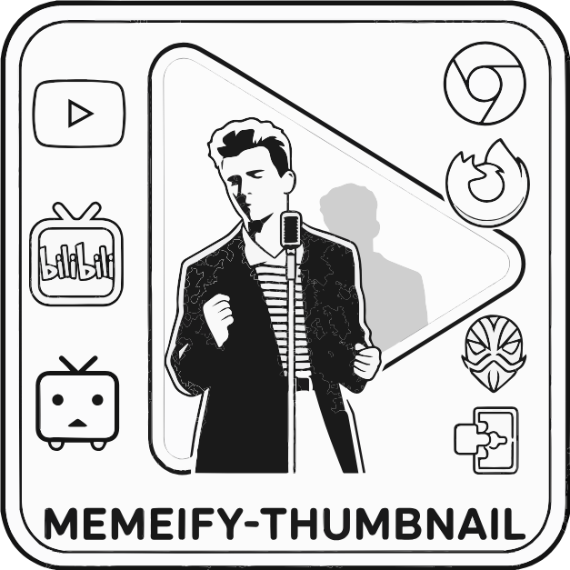

  
  
  <h1>Memeify-Thumbnail</h1>
  
<b>Overlay tools for video thumbnail modification in multiple platforms.</b>

  
   

  

    <a href="README.md">English</a> | 
    <a href="README_CN.md">简体中文</a>
  

  
  
 

## 简体中文

### 这是什么？

Memeify-Thumbnail 是一个开源项目，旨在将自定义的“人物/角色抠图”覆盖到视频平台的缩略图上。厌倦了系统原生的缩略图？想把喜欢的角色放到 Bilibili 或 Niconico 的视频封面上？用这个就够了。

### 为什么做这个？

本项目的灵感直接来源于 [MrBeastify-Youtube](https://www.google.com/search?q=https://github.com/MagicJinn/MrBeastify-Youtube)。原项目是一个有趣的浏览器扩展，但仅限于 YouTube。我们希望将这个思路“工程化”，打造一个支持不同角色、多平台、多设备的通用“缩略图覆盖引擎”。不仅支持桌面浏览器，还计划通过 Magisk/LSPosed 模块让手机端 App 也支持这种魔改。

### 核心特性

* **多平台支持：** 目前规划支持 YouTube、Bilibili、Niconico。
* **角色自定义：** 不再局限于“野兽先生”，允许用户自由指定替换角色。
* **跨平台覆盖：** 提供浏览器插件（桌面端）以及系统级 Hook 方案（Magisk/LSPosed 模块，覆盖移动端 App）。

### 加入我们

说到底，这本质上就是“在封面缩略图上加点人物镂空图”。但好玩的地方在于社区共创的“角色包（Character-Pack）”。
